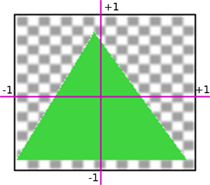

# Camera, view, whatever.

[three.js multiple camera](https://www.google.com/search?q=three.js+multiple+camera&oq=three.js+multiple+camera&aqs=chrome..69i57j0i22i30l2.2131j0j7&sourceid=chrome&ie=UTF-8)

[Brainspell](https://web.archive.org/web/20180206125803/http://brainspell.org/article/24996404)

[How To Create A Loading Screen For Your Three.js App](https://www.youtube.com/watch?v=zMzuPIiznQ4)

[Build a 3D Environment with Three.js](https://www.codecademy.com/article/brandondusch/build-a-3d-environment-with-three-js)

[Build Basic 3D Scenes with Three.js](https://javascript.plainenglish.io/three-js-lesson-1-building-basic-3d-scenes-with-three-js-e06d05c28feb)

[threejsfundamentals multiple-scenes](https://r105.threejsfundamentals.org/threejs/lessons/threejs-multiple-scenes.html)

[comments](https://threejsfundamentals.org/threejs/lessons/threejs-multiple-scenes.html)

[Multiple instances of Three.js in same page to show objects library](https://discourse.threejs.org/t/multiple-instances-of-three-js-in-same-page-to-show-objects-library/18341)

[Display multiple instances of three.js in a single page](https://stackoverflow.com/questions/33959538/display-multiple-instances-of-three-js-in-a-single-page)

> Can three Js do 2D?
JS IS STRUCTURED IN AN ACCESSIBLE WAY. The way that Three. js structures its rendering means that the learning curve won't be too steep. It organizes all of the renders you'll do, whether 3D or 2D, under a “Scene” container.

[ThreeJS Explained In 10 Minutes in 2021 - Kofi Group](https://www.kofi-group.com/threejs-explained-in-10-minutes/)

[YouTube](https://www.youtube.com/watch?v=ZiT2tN2eEro)

> Should I use three Js?
Three. js you can use any way you could use canvas, including full-screen animations, so long as the device supports WebGL. The prospects that Three. js suggest out of the package without any skills in 3D are very important when we want to create some multi-dimensional projects in no time issue.Jan 16, 2018

[Why to Use ThreeJS in Web Application Development? - Cmarix](https://www.cmarix.com/blog/why-to-use-threejs-in-web-application-development/)

# [wtf is scissorTest??](https://gamedev.stackexchange.com/questions/40704/what-is-the-purpose-of-glscissor)

### I like this kind of things explained visually.

In OpenGL we have 2D coordinates that go from -1 to +1 for both the X and Y axis.

Then this image needs to be mapped to window coordinates.

## Picture in picture

[codepen.io](https://codepen.io/anon/pen/EwrbGZ)
