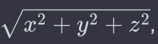

## Understanding 3D Raycasting Numbers

<span style="color:blue;font-size:larger;">This code shoots a ray and intersects with a box.  Explain why `setY` is set to 20 and why `origin` and `direction` are set to (50, -40, 0) and (-1, 1, 0).</span>

```js
geometry = new THREE.CubeGeometry(20, 20, 20);
material = new THREE.MeshNormalMaterial();
mesh = new THREE.Mesh(geometry, material);
mesh.position.setY(20);
scene.add(mesh);

function RayCheck() {
  // Add Ray
  let origin = new THREE.Vector3(50, -40, 0),
    direction = new THREE.Vector3(-1, 1, 0),
    ray = new THREE.Raycaster(origin, direction),
    collisionResults = ray.intersectObjects([mesh]);

  if (collisionResults.length !== 0) {
    console.log(`Ray collides with mesh. Distance: ${collisionResults[0].distance}`);
  }

  // Add Arrow to show ray
  scene.add(new THREE.ArrowHelper(direction, origin, 50, 0x000000));
}
```

1. **Setting `setY` to 20:**

   - `mesh.position.setY(20);` is a command that sets the y-coordinate of the mesh's position to 20. In three.js, the position of an object is determined by its x, y, and z coordinates in 3D space.

   - This means the cube (your mesh) is being placed <span style="color:lime;">20 units above the origin (0,0,0)</span> of the scene along the y-axis. If you didn't set this, the cube would be at the origin of the scene, potentially making it intersect with other objects or the scene floor.

2. **Setting `origin` and `direction` of the ray:**

   - The `origin` is where the ray starts in the 3D space. In your code, `let origin = new THREE.Vector3(50, -40, 0)`, this means the ray starts at the point (50, -40, 0). This point is 50 units along the x-axis, -40 units along the y-axis, and 0 units along the z-axis relative to the origin of the scene. <span style="color:lime;">So it's down and to the right.</span>

   - The `direction` is a vector that points in the direction the ray should travel. In your code, `direction = new THREE.Vector3(-1, 1, 0)`, means the ray is pointing in a direction that is -1 unit along the x-axis, 1 unit along the y-axis, and 0 units along the z-axis. **This vector should usually be normalized (having a length of 1)** to ensure consistent behavior. <span style="color:lime;">Pointing diagonally, up and to the left.</span>

   - The choice of `(50, -40, 0)` for the `origin` and `(-1, 1, 0)` for the `direction` is likely based on where you want the ray to start and in which direction you want it to travel to intersect with the cube. It's a specific choice made to ensure the ray intersects with the cube in your scene.

      <span style="color:lime;">Play with the numbers, and it makes sense.  Like set origin = (1, -1, 0) and see what happens.  Change the position of the box to 40, and it's too far away.</span>

3. **Understanding the Ray and its Interaction with the Cube:**

   - The `Raycaster` is used in three.js to perform raycasting, which is essentially shooting a line (or ray) from a point in a certain direction and checking what objects in the 3D space it intersects with.

   - The `intersectObjects` function is then used to determine if and where the ray intersects with the cube. If the ray intersects with the cube, it will return an array with details of the intersection.

In summary, `setY(20)` places the cube 20 units above the ground, and the `origin` and `direction` of the ray are set to specific values to ensure the ray starts at a particular point in the scene and travels in a specific direction to intersect with the cube. The exact values (50, -40, 0) and (-1, 1, 0) are chosen based on the layout of your 3D scene and where you want the ray to intersect with the cube.

<span style="color:blue;font-size:larger;">This works too.  The arrow will come from the right side of the cube, and intersect mid-cube.</span>

```js
// All you do is play with the numbers
mesh.position.setY(40);
let origin = new THREE.Vector3(70, 40, 0);
```

## Normalize vector

<span style="color:blue;font-size:larger;">You said "This vector should usually be normalized (having a length of 1) to ensure consistent behavior."  Are the numbers (-1, 1, 0) wrong?</span>

The vector `(-1, 1, 0)` in your code is not normalized, meaning its length is not 1. However, whether this is "wrong" or not depends on the context of your application. Let's clarify this:

1. **Normalization of Direction Vectors:**

   - Normalization is the process of adjusting the length of a vector to 1, while keeping its direction unchanged.

   - In many graphics applications, including three.js, it's common to use normalized direction vectors for rays, as this avoids scaling issues and ensures consistent behavior across different parts of the application.

2. **The Vector `(-1, 1, 0)` and its Length:**

   - The vector `(-1, 1, 0)` is not normalized. Its length can be calculated using the formula sqrt{x^2 + y^2 + z^2}, which in this case is sqrt{(-1)^2 + 1^2 + 0^2} = sqrt{2}.

   - Since sqrt{2} is not equal to 1, the vector is not normalized.

   
   
   

   ```js
   Math.sqrt(2) = 1.414
   ```

3. **Impact in Your Code:**

   - In three.js, if the `Raycaster` is given a non-normalized direction vector, it will internally normalize the vector for its calculations. This means that even if you pass a non-normalized vector, three.js will handle it correctly by normalizing it.

   - However, it's generally a good practice to normalize the direction vectors yourself for clarity and to avoid any unexpected behavior, especially if you switch to a different graphics library or perform other calculations where automatic normalization isn't provided.

So, to answer your question, the numbers `(-1, 1, 0)` are not inherently wrong, but they represent a non-normalized vector. If you want to follow best practices, you might consider normalizing this vector before using it. In your specific case, however, three.js will handle the normalization internally.

## Let's try it

<span style="color:blue;font-size:larger;">How can the vector (-1, 1, 0) be normalized in such a way that the ray still intersects with the cube?</span>

To normalize a vector, you need to divide each of its components by the vector's length. The length of a vector (*x, y, z*) is calculated using the formula sqrt{x^2 + y^2 + z^2}. Let's calculate the length of the vector (-1, 1, 0) and then use this to normalize it.

1. **Calculate the Length:**
   The length *L* of the vector (-1, 1, 0) is calculated as follows:
   \[ L = \sqrt{(-1)^2 + 1^2 + 0^2} = \sqrt{1 + 1 + 0} = \sqrt{2} \]

   

2. **Normalize the Vector:**
   To normalize the vector, divide each component by the length *L*. The normalized vector *V<sub>norm</sub>* is:

   

Let's perform these calculations.

```py
import math

# Original vector components
x, y, z = -1, 1, 0

# Calculate the length of the vector
length = math.sqrt(x**2 + y**2 + z**2)

# Normalize the vector
normalized_vector = (x / length, y / length, z / length)
normalized_vector
```

The normalized form of the vector (-1, 1, 0) is approximately (-0.707, 0.707, 0). When you use this normalized vector as the direction for your ray in three.js, it will still point in the same direction as before, but with a standardized length of 1. This ensures that the ray will still intersect with the cube, provided that the cube's position and the ray's origin remain the same. 

You can update your code to use this normalized vector for the `direction`:

```javascript
let direction = new THREE.Vector3(-0.707, 0.707, 0);
```

This change will maintain the ray's intended path while following the best practice of using normalized direction vectors.

<br>
