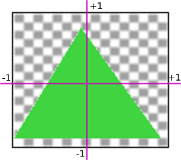

## Mouse position calculation

### Relative horizontal position

The calculation `event.clientX / window.innerWidth` gives us the relative position of the mouse pointer within the horizontal range of the browser window. Let's break it down to make sense of it:

- `event.clientX` represents the **horizontal coordinate** of the mouse pointer when a specific event occurs, such as a mouse click or mouse movement. It is typically measured in pixels from the left edge of the browser window.

- `window.innerWidth` refers to the **width of the browser window**, also measured in pixels. It represents the total horizontal space available for displaying web content.

By dividing `event.clientX` by `window.innerWidth`, we obtain a **value between 0 and 1**, which represents the relative position of the mouse within the horizontal range of the window.

Here's how it works:

- If the mouse pointer is at the very **left** edge of the window, `event.clientX` would be **0**. Dividing 0 by any value gives us 0, indicating that the mouse is at the very leftmost position.

- If the mouse pointer is at the very **right** edge of the window, `event.clientX` would be equal to `window.innerWidth`. Dividing `window.innerWidth` by itself gives us **1**, indicating that the mouse is at the very rightmost position.

- For any other position between the left and right edges, the result of `event.clientX / window.innerWidth` would be a decimal value **between** 0 and 1, representing the proportional distance from the left edge.

In summary, this calculation allows us to determine the **relative horizontal position** of the mouse pointer within the browser window, facilitating various interactions and calculations in web development and JavaScript programming.

### Mouse position normalized to the screen

When calculating the mouse position normalized to the screen, we perform the operation:

```js
mouseRelativeX * 2 - 1;
```

Let's explore the reasons behind multiplying by 2 and subtracting 1:

1. **Multiplying by 2:**
   By multiplying `mouseRelativeX` by 2, we are **scaling** the relative position from the range [0, 1] to [0, 2]. This scaling allows us to expand the range to cover the full width of the normalized coordinate system.

2. **Subtracting 1:**
   After multiplying by 2, we subtract 1 from the result. This step is performed to **center** the coordinate system on the screen. By subtracting 1, we shift the range from [0, 2] to [-1, 1], where 0 represents the center of the screen.

To understand the significance of this normalization process, consider the following:

- The original `mouseRelativeX` value, ranging from 0 to 1, represents the position of the mouse relative to the width of the browser window.
- By multiplying by 2, the range expands to cover the full width of the normalized coordinate system, which is twice the width of the screen.
- Subtracting 1 centers the coordinate system, with 0 representing the middle of the screen horizontally.

The resulting value of `mouseRelativeX * 2 - 1` provides a normalized coordinate that spans the entire screen width, with **0 representing the center.** This normalization is useful when working with graphics, simulations, or other scenarios where a standardized coordinate system is required.


## Inverted NDC Mouse Position

The formula

```js
-(event.clientY / window.innerHeight) * 2 + 1
```

is used to calculate the relative vertical mouse position in a normalized coordinate system called "Normalized Device Coordinates" (NDC).

Let's break down the formula to understand why the negation and addition are used:

1. `vertical = (event.clientY / window.innerHeight)`:
   This part calculates the vertical position of the mouse relative to the height of the window. It gives a value between 0 and 1, where 0 represents the top edge of the window, and 1 represents the bottom edge.

2. `-(vertical)`:
   **The negation (`-`) is applied to invert the direction.** Without the negation, the value would increase as the mouse moves down, which might be opposite to the desired behavior. By negating the value, the direction is flipped so that it increases as the mouse moves up.

3. `-(vertical) * 2`:
   Multiplying by 2 scales the value from the range of 0-1 to 0-2. This doubling of the range helps to cover the full vertical extent of the NDC system, where the valid range is typically -1 to 1.

4. `-(vertical) * 2 + 1`:
   Finally, the addition of 1 shifts the range from -1 to 1. The resulting value is now mapped to the range of -1 to 1, which is the desired range for the vertical position in NDC. The top edge of the window corresponds to -1, the bottom edge to 1, and the middle of the window to 0.

By following this formula, the relative vertical mouse position is transformed to a range that matches the NDC coordinate system commonly used in computer graphics, making it easier to work with and compare against other values in the same coordinate space.




## Put the thing where I clicked (verbiage)

The `createTextObject` function expects the x and y coordinates to be in the **scene's coordinate space,** but the `onClick` function is currently passing the coordinates based on the **screen's client space** (event.clientX and clientY).

You need to convert the screen coordinates (`event.clientX` and `event.clientY`) to the scene's coordinates. You can achieve this by using the `THREE.Vector2` class to unproject the mouse coordinates into the scene.

The script should now correctly convert the mouse coordinates from the screen space to the scene space, allowing the text objects to be created at the desired positions when the user clicks on the screen.

## Convert DOM to Screen

```js
let elem = renderer.domElement;
let rect = elem.getBoundingClientRect();
```

To convert the **`left` and `top` coordinates** obtained to Three.js **screen coordinates**, you can use the following steps:

1. Get the dimensions of the renderer's canvas:

    ```javascript
    const canvas = renderer.domElement;
    const canvasWidth = canvas.width;
    const canvasHeight = canvas.height;
    ```

2. Calculate the aspect ratio of the renderer's canvas:

    ```javascript
    const aspectRatio = canvasWidth / canvasHeight;
    ```

3. Convert the `left` and `top` coordinates to normalized device coordinates (NDC), where `(0, 0)` represents the bottom-left corner of the canvas and `(1, 1)` represents the top-right corner of the canvas:

    ```javascript
    const ndcX = (left - canvas.offsetLeft) / canvasWidth;
    const ndcY = 1 - (top - canvas.offsetTop) / canvasHeight;
    ```

4. Convert the normalized device coordinates (NDC) to Three.js screen coordinates, where `(-1, -1)` represents the bottom-left corner of the screen and `(1, 1)` represents the top-right corner of the screen:

    ```javascript
    const screenX = (ndcX * 2 - 1) * aspectRatio;
    const screenY = ndcY * 2 - 1;
    ```

The resulting `screenX` and `screenY` values represent the Three.js screen coordinates corresponding to the `left` and `top` coordinates obtained from `renderer.domElement.getBoundingClientRect()`.

## Example

```javascript
const canvas = renderer.domElement;
const canvasWidth = canvas.width;
const canvasHeight = canvas.height;
const aspectRatio = canvasWidth / canvasHeight;

const boundingRect = canvas.getBoundingClientRect();
const left = boundingRect.left; // Left coordinate
const top = boundingRect.top; // Top coordinate

const ndcX = (left - canvas.offsetLeft) / canvasWidth;
const ndcY = 1 - (top - canvas.offsetTop) / canvasHeight;

const screenX = (ndcX * 2 - 1) * aspectRatio;
const screenY = ndcY * 2 - 1;

// Use the screenX and screenY coordinates as needed
console.log(`Screen coordinates: (${screenX}, ${screenY})`);
```

Make sure to replace the `...` with your actual `left` and `top` coordinates obtained from `renderer.domElement.getBoundingClientRect()`.

<br>
