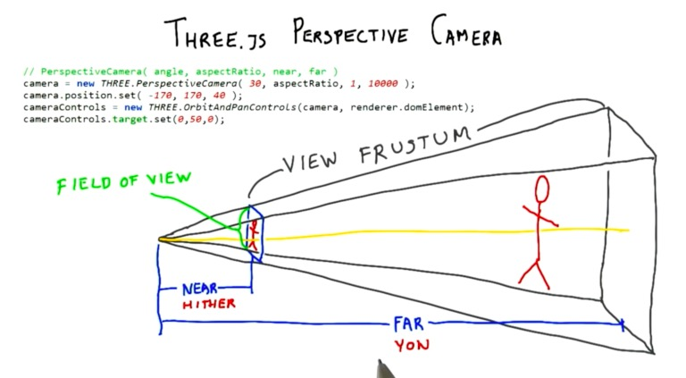

# Camera 🎥

# Position

```js
camera.position.x = 1; // horizontal movement
camera.position.y = 1; // up and down
camera.position.z = 5; // zoom in or out
```

### X

* Negative = left
* Positive = right

### Y

* Negative = down
* Positive = up

### Z = low and high value

* The lower the number, the closer it is.
* The higher, the further away.
* If it's negative, it's behind the object

<mark>**NOTE!** The *object* moves in the opposite direction.</mark>

<br>

# Perspective Camera

**[Udacity - Perspective Camera](https://youtu.be/KyTaxN2XUyQ)**

**Field of view:** the angle between the top and bottom planes of the view pyramid.

Specified in **degrees**!  Other angles use **radians** (hence the conversions, such as):

```js
function degreesToRadians(degrees) {
  return degrees * (Math.PI / 180);
}
```

Call **update()**: if you change fov, near, or far, you need to call **`camera.updateProjectionMatrix()`** in order to have these changes take effect.



<br>

# [How to control camera.position.x from dat.GUI](https://discourse.threejs.org/t/how-to-control-camera-position-x-from-dat-gui/27467)

It was stupidly complicated, but I learned something.

```js
camera.updateMatrixWorld();
```

Also, they rolled their own [axis helper](https://jsfiddle.net/fiddleuser01/rezcpgh4/7/).

<br>

<mark>Difference between updateMatrixWorld() and updateProjectionMatrix()</mark>

# One is a world 🌎, one is a camera (projection). 📽️

I thought, at first.  updateMatrixWorld works on Object3D.

But I'm here because: 

```js
function render() {
  camera.updateMatrixWorld();
}
```

It's not used that much:

```bash
ackk updateMatrixWorld
# Count  14
# Files   4
```

This one sparks joy. In everything.

```bash
ackk updateProjectionMatrix
# Count  68
# Files  a gazillion, at least
```

<br>

# updateProjectionMatrix() 📽️

After making changes to most camera properties, you will have to call [updateProjectionMatrix](http://127.0.0.1:5501/docs/#api/en/cameras/PerspectiveCamera.updateProjectionMatrix) for the changes to take effect.

We do it all the time when we resize the canvas.

```js
function onWindowResize() {
  camera.aspect = w / h;
  camera.updateProjectionMatrix();
  renderer.setSize(w, h);
}
```

<br>

# updateMatrixWorld() 🌎

**[From the docs:](https://threejs.org/docs/#api/en/core/Object3D)**

force - A boolean that can be used to **bypass** `.matrixWorldAutoUpdate`, to recalculate the world matrix of the object and descendants on the current frame.

Useful **if you cannot wait** for the renderer to update it on the next frame (assuming `.matrixWorldAutoUpdate` set to true).

Call it in `render()`.

<br>

# Camera Helper

[CameraHelper not linked?](https://discourse.threejs.org/t/camerahelper-not-linked/2319/2)
  
Solution: `helper.update();`

<br>

# Cameras 🎥 🎥

Plural.