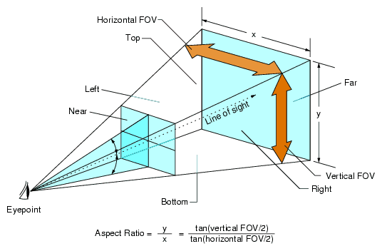
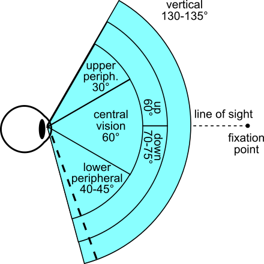
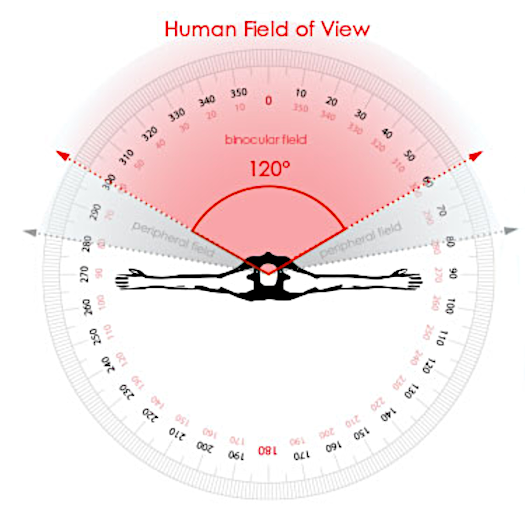
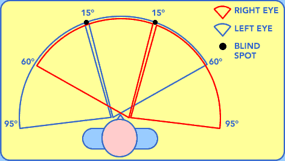

## Vertical field of view

### FOV 120°

[Glossary:Field of view (FOV)](https://www.pcgamingwiki.com/wiki/Glossary:Field_of_view_%28FOV%29)

 

<!--https://www.wikiwand.com/en/Field_of_view-->

[What is Field of View?](https://perception28.wordpress.com/2017/02/04/vision-field-of-view/)

Field of view is the angular extent of what can be seen with the eye. Various animals have different visual fields. Predators generally have more **forward facing** with **binocular** oriented vision, whereas prey have side facing visual fields with greater range (for defensive vision).

 

## Binocular vision

[What is Binocular Vision?](https://www.seevividly.com/info/Binocular_Vision)

What we see is the result of signals sent from the eyes to the brain. Usually, the brain receives signals from **both (bi) eyes (ocular)** at the same time.

Unlike some other animals, **humans' eyes are both set on the front of the face**, permitting binocular vision.

This forward-facing orientation of the eye means each eye has a rather similar view of an image. The **field of view**, which is **the area that you can see when you close one eye**, overlaps significantly between each eye also.

[What is a normal visual field?](https://www.vision-and-eye-health.com/visual-field.html)

 

## Calculating the Viewing Frustum in a 3D Space

[stackoverflow](https://stackoverflow.com/questions/13665932/calculating-the-viewing-frustum-in-a-3d-space)

 
