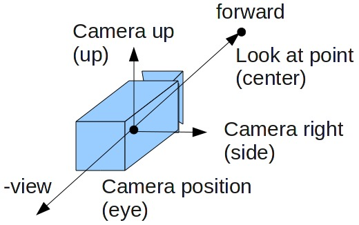

## Camera Orientation

<span style="color:#0000dd;">Does the camera automatically look at the origin (0, 0, 0) by default, or is it better to set camera.lookAt after initializing the camera?</span>

```js
camera.lookAt(new THREE.Vector3(0, 0, 0));
```

<br>

In Three.js, when you create a new camera using `THREE.PerspectiveCamera` or `THREE.OrthographicCamera`, the camera is positioned so that its local -Z axis points towards the origin `(0, 0, 0)` by default. In other words, the camera "looks at" the origin initially.

However, it's often a good practice to explicitly set the `lookAt` method to ensure that the camera is oriented as you intend, especially if you're going to be moving the camera or changing its orientation during the course of your program.

Here's a basic example:

```javascript
const camera = new THREE.PerspectiveCamera(75, window.innerWidth / window.innerHeight, 0.1, 1000);
camera.position.set(0, 1, 5);  // Setting the camera position
camera.lookAt(new THREE.Vector3(0, 0, 0));  // Ensuring the camera looks at the origin
```

By explicitly calling `lookAt`, you make the behavior of your program more predictable and easier to understand.

Also, when you're moving the camera dynamically, you may need to call `camera.lookAt()` again to update its orientation.

If the camera is a child of another object, you will also often need to call <a href="updateMatrixWorld.md">updateMatrixWorld</a> to ensure that the changes propagate correctly:

```javascript
camera.lookAt(new THREE.Vector3(0, 0, 0));
camera.updateMatrixWorld();
```

So, while not strictly necessary at initialization if you're happy with the default orientation, using `lookAt` can be a good habit.

<!-- http://tanrobby.github.io/note/opengl/gluLookAt.jpg -->


## Set Position


When you set `camera.position.set(0, 1, 5)`, you're positioning the camera in 3D space according to the Cartesian coordinate system used in Three.js:

- `x = 0`: The camera is aligned with the Y-Z plane, meaning it is directly en frente de the origin along the X-axis.
- `y = 1`: The camera is 1 unit above the X-Z plane. In human terms, you could think of it as being "1 unit above the ground."
- `z = 5`: The camera is 5 units away from the origin along the Z-axis. In the default Three.js coordinate system, positive Z-values extend "out of the screen," so the camera would be placed 5 units "in front of" the origin, looking back towards it.

In more intuitive terms, imagine you are standing 5 meters away from an object, directly in front of it. If you then elevate yourself 1 meter above the ground, that would be your "camera position" in this case. You would be looking back towards the object (the origin, in this case), which is how the `lookAt(0, 0, 0)` function orients the camera.

## controls.target vs camera.lookAt

[Controls.target vs camera.lookAt](https://discourse.threejs.org/t/controls-target-vs-camera-lookat/5086/6)

I used `camera.lookAt()` to set direction in which camera looks.

Reading on OrbitControls, I learned that camera.lookAt() should be replaced by `controls.target`.

Why?

OrbitControls internally uses Object3D.lookAt() in order to look at the defined
target location of focus (OrbitControls.target).

> When I use it, panning becomes an issue.
> 
> Target object doesn't pan with rest of the scene,
> 
> and is static while panning.

That's the intended behavior since **panning transforms** the `OrbitControls.target` vector.

In other words, the **location of focus.**

You also have to call `controls.update()` after changing the target.

OrbitControls ensures that the camera orbits (rotates) around the target.

Rotation and zooming also happens with focus on target. (Focused on the defined target vector.)

<br>
