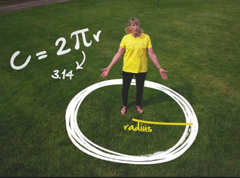
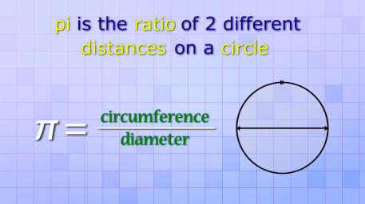

[GRCC Mathematics: The Number Tau](https://youtu.be/8hqLV9Qao6Y)

# C = 2 π r

# C = 𝛕r



[Math Antics - Circles, What Is PI?](https://youtu.be/cC0fZ_lkFpQ)



Tau = The circle constant to represent a full rotation around a circle in radians.

2pi

The ratio of a circle's circumference to its radius.

[https://www.livescience.com/14836-pi-wrong-tau.html](https://www.livescience.com/14836-pi-wrong-tau.html)

```js
// The number π is a mathematical constant that is the ratio of a circle's circumference to its diameter.
const pi = Math.PI;

// 2pi is the ratio of a circle's circumference to its radius.
// the circle constant to represent a full rotation around a circle in radians
// The value of τ is approximately 6.283 and can be calculated by dividing any circle's circumference by its radius.
const tau = pi * 2;
```

*As it turns out, they're saying that pi is "wrong", and so is tau.*
