# Concepts ⭐️

# Lazy Loading of Data 

[Google Search](https://www.google.com/search?q=lazy+loading+of+data&oq=lazy+loading+of+data&aqs=chrome..69i57j0i22i30l9.2657j0j7&sourceid=chrome&ie=UTF-8)

Lazy Loading 🆚 Eager Loading

[Native image lazy-loading for the web!](https://addyosmani.com/blog/lazy-loading/)

[Tips for rolling your own lazy loading](https://css-tricks.com/tips-for-rolling-your-own-lazy-loading/)

[netlify](https://lazy-load-nlm.netlify.com)

 

# Imaging Level of Detail

[Google Search](https://www.google.com/search?q=imaging+level+of+detail&oq=imaging+level+of+detail&aqs=chrome..69i57j33i160j33i299l2.12167j0j7&sourceid=chrome&ie=UTF-8)

In computer graphics, level of detail (LOD) refers to the complexity of a 3D model representation.

Level of Detail can be decreased as the model moves away from the viewer. **(Distance!)**

Or according to other metrics, such as object importance, viewpoint-relative speed, or position.

An example of various DLOD ranges. Darker areas are meant to be rendered with higher detail. An additional culling operation is run, discarding all the information outside the frustum (colored areas).

[Level of Detail in 3D City Model](https://www.treistek.com/post/level-of-detail-in-3d-city-model)

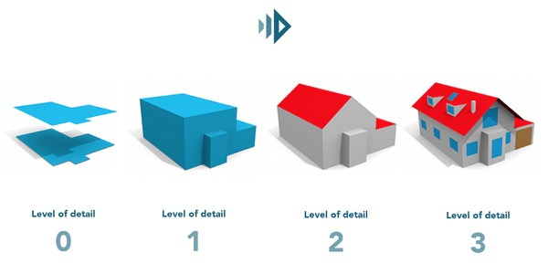

 

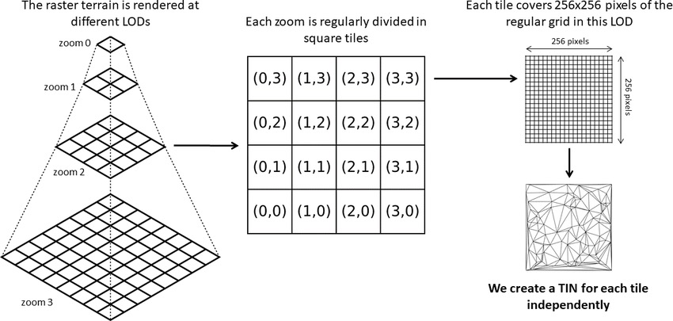

 

# Frustum

[Google Search](https://www.google.com/search?q=frustum&spell=1&sa=X&ved=2ahUKEwiMwrK0n875AhWgj4kEHThuApkQBSgAegQIAhA1&biw=1389&bih=729&dpr=2.5)

In geometry, a frustum (from the Latin for "morsel"; plural: frusta or frustums) is the portion of a solid (normally a pyramid or a cone) that lies between one or two parallel planes cutting it. The base faces are polygonal, the side faces are trapezoidal

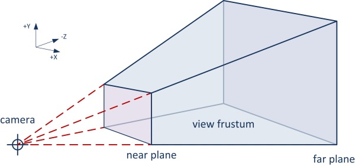

 

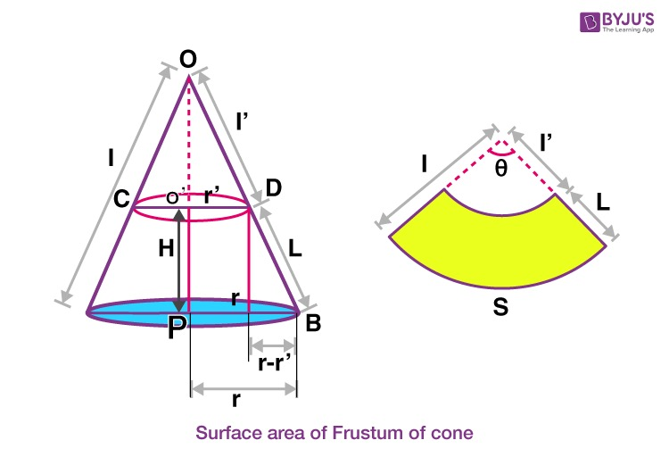

three.js/camera frustum, tricks with frustum, idk 🤔

 

# Culling

[Google Search](https://www.google.com/search?q=three.js+culling&oq=three.js+culling&aqs=chrome..69i57j0i22i30l6j0i390l3.2220j0j7&sourceid=chrome&ie=UTF-8)

[Does Three.js automatically cull objects that are not visible behind other objects?](https://stackoverflow.com/questions/67428704/does-three-js-automatically-cull-objects-that-are-not-visible-behind-other-objec)

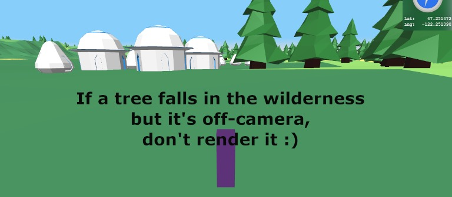

 

# Raycasting

[Tutorial](http://soledadpenades.com/articles/three-js-tutorials/object-picking/)

[Lode's Computer Graphics Tutorial - Raycasting](https://lodev.org/cgtutor/raycasting.html)

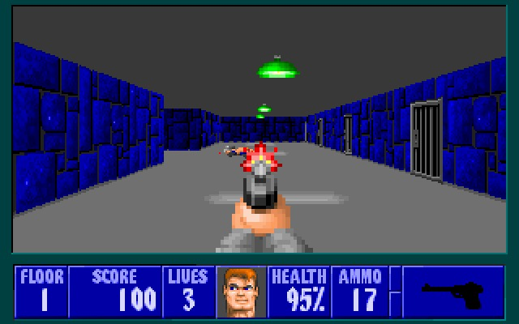

 

# Editing a Polygon in three.js

[Google Search](https://www.google.com/search?q=editing+a+polygon+in+three.js&oq=editing+a+polygon+in+three.js&aqs=chrome..69i57j33i22i29i30l5.3805j0j7&sourceid=chrome&ie=UTF-8)

[Drawing a line with three.js dynamically](https://stackoverflow.com/questions/31399856/drawing-a-line-with-three-js-dynamically)

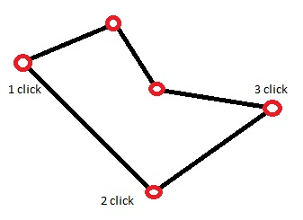

 

[Introduction To Polygonal Modeling And Three.js](https://www.smashingmagazine.com/2013/09/introduction-to-polygonal-modeling-and-three-js/)

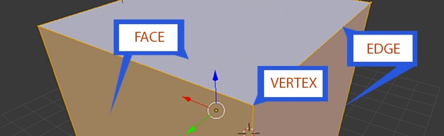

 

# Deep Learning Distributed Training

[Distributed Training in a Deep Learning Context](https://blog.ovhcloud.com/distributed-training-in-a-deep-learning-context/)

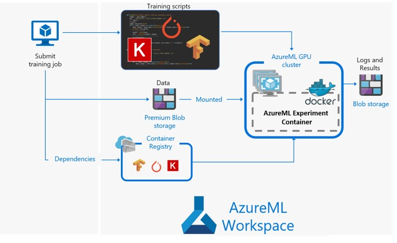

 

### Interactive - click on box, and it highlights - that concept; identifying a single object.

# Axes

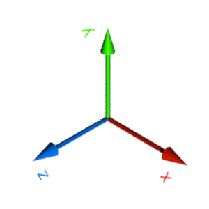

# Yaw, Pitch, Roll

<!--  -->

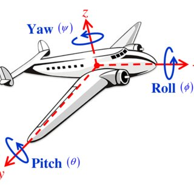

# Quaternion

[Don't Get Lost in Deep Space: Understanding Quaternions](https://www.allaboutcircuits.com/technical-articles/dont-get-lost-in-deep-space-understanding-quaternions/)

Quaternions are an alternate way to describe orientation or rotations in 3D space using an ordered set of four numbers.

They have the ability to uniquely describe any three-dimensional rotation about an arbitrary axis and do not suffer from **gimbal lock**.

[Rotating objects in 3D Engines](https://artrointel.github.io/rotating-objects/)

[Understanding Quaternion](https://www.ceva-dsp.com/ourblog/what-is-a-quaterion/)

[Rotating 3D shapes](https://www.khanacademy.org/computing/computer-programming/programming-games-visualizations/programming-3d-shapes/a/rotating-3d-shapes)

# Vertex

### What word do we use to describe where 2 edges meet and touch?

Vertices in shapes are the points where two or more line segments or edges meet (like a corner). The singular of vertices is vertex. For example a cube has 8 vertices and a cone has one vertex. Vertices are sometimes called corners but when dealing with 2D and 3D shapes, the word vertices is preferred.

[What Are Vertices, Faces And Edges?](https://thirdspacelearning.com/blog/what-are-vertices-faces-edges/)
