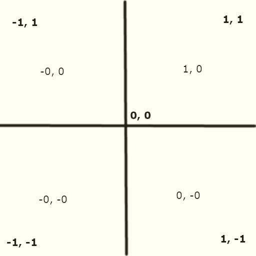

It all started with...

<!--https://stackoverflow.com/questions/73705786/how-to-free-draw-a-line-in-three-js-r144-on-mouse-move-and-using-buffergeometry#73713583-->

# compute the side planes of the view frustum

[Frustum Calculation And Culling, Hopefully Demystified](http://davidlively.com/programming/graphics/frustum-calculation-and-culling-hopefully-demystified/)

This is valid for **view space**, where the camera is at the origin and pointed along the Z axis...

**define "view space"**

The view space is what people usually refer to as **the camera of OpenGL** (it is sometimes also known as camera space or eye space).

The view space is the result of transforming your world-space coordinates to coordinates that are in front of the user's view.

[Coordinate Systems](https://learnopengl.com/Getting-started/Coordinate-Systems)

<table>
<thead>
<tr>
<th colspan="3">Input values</th>
</tr>
<tr>
<th>Symbol</th>
<th>Meaning</th>
<th>Typical value</th>
</tr>
</thead>
<tbody>
<tr>
<td><span class="MathJax_Preview" style=""></span><span class="MathJax" id="MathJax-Element-1-Frame" tabindex="0" style=""><nobr><span class="math" id="MathJax-Span-1" style="width: 2.384em; display: inline-block;"><span style="display: inline-block; position: relative; width: 2.018em; height: 0px; font-size: 117%;"><span style="position: absolute; clip: rect(1.59em, 1002.018em, 2.933em, -999.997em); top: -2.439em; left: 0em;"><span class="mrow" id="MathJax-Span-2"><span class="mi" id="MathJax-Span-3" style="font-family: STIXGeneral-Italic;">𝑓<span style="display: inline-block; overflow: hidden; height: 1px; width: 0.064em;"></span></span><span class="mi" id="MathJax-Span-4" style="font-family: STIXGeneral-Italic;">𝑜</span><span class="msubsup" id="MathJax-Span-5"><span style="display: inline-block; position: relative; width: 0.919em; height: 0px;"><span style="position: absolute; clip: rect(3.361em, 1000.491em, 4.216em, -999.997em); top: -4.026em; left: 0em;"><span class="mi" id="MathJax-Span-6" style="font-family: STIXGeneral-Italic;">𝑣</span><span style="display: inline-block; width: 0px; height: 4.032em;"></span></span><span style="position: absolute; top: -3.904em; left: 0.491em;"><span class="mi" id="MathJax-Span-7" style="font-size: 70.7%; font-family: STIXGeneral-Italic;">𝑦</span><span style="display: inline-block; width: 0px; height: 4.032em;"></span></span></span></span></span><span style="display: inline-block; width: 0px; height: 2.445em;"></span></span></span><span style="display: inline-block; overflow: hidden; vertical-align: -0.425em; border-left-width: 0px; border-left-style: solid; width: 0px; height: 1.289em; --darkreader-inline-border-left: initial;" data-darkreader-inline-border-left=""></span></span></nobr></span><script type="math/tex" id="MathJax-Element-1">fov_y</script></td>
<td>Vertical field of view</td>
<td>60 – 120 degrees</td>
</tr>
<tr>
<td><span class="MathJax_Preview" style=""></span><span class="MathJax" id="MathJax-Element-2-Frame" tabindex="0" style=""><nobr><span class="math" id="MathJax-Span-8" style="width: 2.995em; display: inline-block;"><span style="display: inline-block; position: relative; width: 2.567em; height: 0px; font-size: 117%;"><span style="position: absolute; clip: rect(1.712em, 1002.567em, 2.811em, -999.997em); top: -2.439em; left: 0em;"><span class="mrow" id="MathJax-Span-9"><span class="mi" id="MathJax-Span-10" style="font-family: STIXGeneral-Italic;">𝑎</span><span class="mi" id="MathJax-Span-11" style="font-family: STIXGeneral-Italic;">𝑠</span><span class="mi" id="MathJax-Span-12" style="font-family: STIXGeneral-Italic;">𝑝</span><span class="mi" id="MathJax-Span-13" style="font-family: STIXGeneral-Italic;">𝑒</span><span class="mi" id="MathJax-Span-14" style="font-family: STIXGeneral-Italic;">𝑐</span><span class="mi" id="MathJax-Span-15" style="font-family: STIXGeneral-Italic;">𝑡</span></span><span style="display: inline-block; width: 0px; height: 2.445em;"></span></span></span><span style="display: inline-block; overflow: hidden; vertical-align: -0.282em; border-left-width: 0px; border-left-style: solid; width: 0px; height: 1.004em; --darkreader-inline-border-left: initial;" data-darkreader-inline-border-left=""></span></span></nobr></span><script type="math/tex" id="MathJax-Element-2">aspect</script></td>
<td>Aspect ratio</td>
<td>around 1.8 – use frame buffer Width / Height</td>
</tr>
<tr>
<td><span class="MathJax_Preview" style=""></span><span class="MathJax" id="MathJax-Element-3-Frame" tabindex="0" style=""><nobr><span class="math" id="MathJax-Span-16" style="width: 2.323em; display: inline-block;"><span style="display: inline-block; position: relative; width: 1.957em; height: 0px; font-size: 117%;"><span style="position: absolute; clip: rect(1.529em, 1001.957em, 2.506em, -999.997em); top: -2.134em; left: 0em;"><span class="mrow" id="MathJax-Span-17"><span class="msubsup" id="MathJax-Span-18"><span style="display: inline-block; position: relative; width: 1.896em; height: 0px;"><span style="position: absolute; clip: rect(3.422em, 1000.491em, 4.216em, -999.997em); top: -4.026em; left: 0em;"><span class="mi" id="MathJax-Span-19" style="font-family: STIXGeneral-Italic;">𝑧</span><span style="display: inline-block; width: 0px; height: 4.032em;"></span></span><span style="position: absolute; top: -3.904em; left: 0.491em;"><span class="texatom" id="MathJax-Span-20"><span class="mrow" id="MathJax-Span-21"><span class="mi" id="MathJax-Span-22" style="font-size: 70.7%; font-family: STIXGeneral-Italic;">𝑛</span><span class="mi" id="MathJax-Span-23" style="font-size: 70.7%; font-family: STIXGeneral-Italic;">𝑒</span><span class="mi" id="MathJax-Span-24" style="font-size: 70.7%; font-family: STIXGeneral-Italic;">𝑎</span><span class="mi" id="MathJax-Span-25" style="font-size: 70.7%; font-family: STIXGeneral-Italic;">𝑟</span></span></span><span style="display: inline-block; width: 0px; height: 4.032em;"></span></span></span></span></span><span style="display: inline-block; width: 0px; height: 2.14em;"></span></span></span><span style="display: inline-block; overflow: hidden; vertical-align: -0.282em; border-left-width: 0px; border-left-style: solid; width: 0px; height: 0.861em; --darkreader-inline-border-left: initial;" data-darkreader-inline-border-left=""></span></span></nobr></span><script type="math/tex" id="MathJax-Element-3">z_{near}</script></td>
<td>distance from camera to near clip plane in Z</td>
<td>+1</td>
</tr>
<tr>
<td><span class="MathJax_Preview" style=""></span><span class="MathJax" id="MathJax-Element-4-Frame" tabindex="0" style=""><nobr><span class="math" id="MathJax-Span-26" style="width: 2.018em; display: inline-block;"><span style="display: inline-block; position: relative; width: 1.712em; height: 0px; font-size: 117%;"><span style="position: absolute; clip: rect(1.529em, 1001.712em, 2.628em, -999.997em); top: -2.134em; left: 0em;"><span class="mrow" id="MathJax-Span-27"><span class="msubsup" id="MathJax-Span-28"><span style="display: inline-block; position: relative; width: 1.651em; height: 0px;"><span style="position: absolute; clip: rect(3.422em, 1000.491em, 4.216em, -999.997em); top: -4.026em; left: 0em;"><span class="mi" id="MathJax-Span-29" style="font-family: STIXGeneral-Italic;">𝑧</span><span style="display: inline-block; width: 0px; height: 4.032em;"></span></span><span style="position: absolute; top: -3.904em; left: 0.491em;"><span class="texatom" id="MathJax-Span-30"><span class="mrow" id="MathJax-Span-31"><span class="mi" id="MathJax-Span-32" style="font-size: 70.7%; font-family: STIXGeneral-Italic;">𝑓<span style="display: inline-block; overflow: hidden; height: 1px; width: 0.064em;"></span></span><span class="mi" id="MathJax-Span-33" style="font-size: 70.7%; font-family: STIXGeneral-Italic;">𝑎</span><span class="mi" id="MathJax-Span-34" style="font-size: 70.7%; font-family: STIXGeneral-Italic;">𝑟</span></span></span><span style="display: inline-block; width: 0px; height: 4.032em;"></span></span></span></span></span><span style="display: inline-block; width: 0px; height: 2.14em;"></span></span></span><span style="display: inline-block; overflow: hidden; vertical-align: -0.425em; border-left-width: 0px; border-left-style: solid; width: 0px; height: 1.004em; --darkreader-inline-border-left: initial;" data-darkreader-inline-border-left=""></span></span></nobr></span><script type="math/tex" id="MathJax-Element-4">z_{far}</script></td>
<td>distance from camera to far clip plane. <b>MUST be greater than zNear.</b></td>
<td>1000</td>
</tr>
</tbody>
</table>

<br>

# Vertical field of view

## FOV 120°

[Glossary:Field of view (FOV)](https://www.pcgamingwiki.com/wiki/Glossary:Field_of_view_%28FOV%29)


<br>

<!--https://www.wikiwand.com/en/Field_of_view-->


[What is Field of View?](https://perception28.wordpress.com/2017/02/04/vision-field-of-view/)

Field of view is the angular extent of what can be seen with the eye. Various animals have different visual fields. Predators generally have more **forward facing** with **binocular** oriented vision, whereas prey have side facing visual fields with greater range (for defensive vision).


<br>

# Binocular vision

[What is Binocular Vision?](https://www.seevividly.com/info/Binocular_Vision)

What we see is the result of signals sent from the eyes to the brain. Usually, the brain receives signals from **both (bi) eyes (ocular)** at the same time.

Unlike some other animals, **humans' eyes are both set on the front of the face**, permitting binocular vision.

This forward-facing orientation of the eye means each eye has a rather similar view of an image. The **field of view**, which is **the area that you can see when you close one eye**, overlaps significantly between each eye also.

[What is a normal visual field?](https://www.vision-and-eye-health.com/visual-field.html)


<br>

# Calculating the Viewing Frustum in a 3D Space

### [Peep](https://stackoverflow.com/questions/13665932/calculating-the-viewing-frustum-in-a-3d-space)


[ViewFrustum.svg](https://en.wikipedia.org/wiki/Viewing_frustum#/media/File:ViewFrustum.svg)

# Coordinates

[Soledad Penadés object-picking](https://soledadpenades.com/articles/three-js-tutorials/object-picking/)

```js
let container = document.getElementById( "container" );
let containerWidth = container.clientWidth;
let containerHeight = container.clientHeight;

mouseVector.x = 2 * (e.clientX / containerWidth) - 1;
mouseVector.y = 1 - 2 * ( e.clientY / containerHeight );

// otherwise, it's window.innerWidth, window.innerHeight
```

They convert the mouse coordinates, which go from 0 to containerWidth, and from 0 to containerHeight, to (-1, 1) in both axes.

Did you notice that the calculations for the y coordinate are negated? That's because in the classic DOM coordinate system, the Y axis grows from top to bottom (i.e. top is 0), whereas in 3D it grows from bottom to top (i.e. bottom is 0).


<br>




