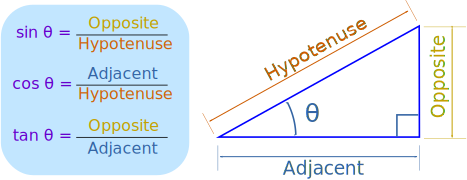

# Math.sin

Calculating the path for an arc of a circle.  That's what it's for.

```js
x = Math.cos
y = Math.sin
z = Math.sin
```

# What does math sin do?

The [Math.sin()](https://developer.mozilla.org/en-US/docs/Web/JavaScript/Reference/Global_Objects/Math/sin) function returns the sine of a number in radians.

Pass argument: A number representing an angle in radians.

Return value: The sine of x, between -1 and 1, inclusive.

### ([Thank you.](https://stackoverflow.com/questions/72270247/react-calculate-dots-position-in-a-circle) omg...)

```js
// You could use the following functions to get X and Y coords

// Example for a circle with 100 px radius:

function getCircleY(radians, radius) {
  return Math.sin(radians) * radius;
}

function getCircleX(radians, radius) {
  return Math.cos(radians) * radius;
}

console.log("Y coord at 0 degree", getCircleY(0, 100));
console.log("X coord at 0 degree", getCircleX(0, 100));


console.log("Y coord at 180 degree", getCircleY(Math.PI, 100));
console.log("X coord at 180 degree", getCircleX(Math.PI, 100));
```

# Radian
[Radian](https://www.mathsisfun.com/geometry/radians.html): the angle made when we take the radius and wrap it round the circle.

In a half circle there are `π` radians, which is also 180°.

```txt
π radians = 180°
So 1 radian = 180°/π
= 57.2958...°
```

**To go from degrees to radians:** multiply by π, divide by 180.

**To go from radians to degrees:** multiply by 180, divide by π.

```js
// three.js
const DEG2RAD = Math.PI / 180;
const RAD2DEG = 180 / Math.PI;

function degToRad(degrees) {
  return degrees * DEG2RAD;
}

function radToDeg(radians) {
  return radians * RAD2DEG;
}

// code example usage

// get the angle as radians
const toRadians = function() {
  return angle * (Math.PI / 180.0);
}

// https://stackoverflow.com/questions/5736398/how-to-calculate-the-svg-path-for-an-arc-of-a-circle
let angleInRadians = angleInDegrees * Math.PI / 180.0;
let x = centerX + radius * Math.cos(angleInRadians);
let y = centerY + radius * Math.sin(angleInRadians);

// Loop around the tree, adding presents every 20 to 40 degrees.
for (let angle = 0; angle < 360; angle += Math.random() * 20 + 20) {
  let p = new Present();
  let radius = Math.random() * 40 + 50;
  // degrees to radians, bc that's what we pass to sin & cos
  p.position.x = Math.cos((angle * Math.PI) / 180) * radius;
  p.position.z = Math.sin((angle * Math.PI) / 180) * radius;
  p.scale.set(Math.random() + 1, Math.random() + 1, Math.random() + 1);
  scene.add(p);
}


position.z = Math.sin((angle * Math.PI) / 180) * radius;

camera.position.x = radius * Math.sin(THREE.MathUtils.degToRad(theta));

```

# [What radian?](https://www.essai.in/blog/2019/2/25/what-exactly-is-a-radian)

Now most of us are used to using the conversion formula for degrees to radians and vice versa but ever wondered how it came about? It's actually fairly simple. The **circumference** of a circle is **2 times π times r** which means that there are approximately 6.28 Radians in a full circle. 

Another way of thinking about this is to imagine you are standing in a circular park and you go for a walk around the outside of the park. You can either calculate this as walking the circumference of the park (which is 6.28 Radians) or walking  360 Degrees around it which in a way is the exact same thing

It is from this relationship that we say `2*π*r = 360` Degrees or that 1 Radian = `180/π` Degrees and 1 Degree = `π/180` Radians.

# Sine, Cosine and Tangent

[Sine, Cosine and Tangent](https://www.mathsisfun.com/sine-cosine-tangent.html) are the main functions used in Trigonometry and are based on a Right-Angled Triangle.

Each side of a right triangle has a name:


**Adjacent** is always next to the angle.<br>And **Opposite** is opposite the angle.

Sine, Cosine and Tangent (often shortened to sin, cos and tan) are each a ratio of sides of a right angled triangle.



To calculate them:

Divide the length of one side by another side.

# Why do we call the angle theta?

In ancient Greek, theta is the go-to variable to represent a generic angle. Most often, θ is a variable that stands for an angle in geometry.

Generally, φ represents longitude and θ represents latitude, though the choice is arbitrary.

Often, two angles in the same plane are represented by α and β.

```js
this.phi = (90 - this.lat) * Math.PI / 180;
this.theta = this.lon * Math.PI / 180;
```
